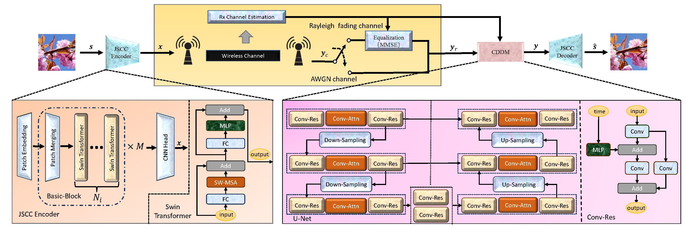

<div align="center">
<h1>CDDM </h1>
<h3>CDDM : Channel Denoising Diffusion Models for Semantic Communications</h3>


Tong Wu, Zhiyong Chen, Senior Member, IEEE, Dazhi He, Member, IEEE, Liang Qian, Yin Xu, Member, IEEE, Meixia Tao, Fellow, IEEE, and Wenjun Zhang, Fellow

Cooperative Medianet Innovation Center (CMIC),Shanghai Jiao Tong University, Shanghai Key Laboratory of Digital Media Processing and Transmission


Paper : https://ieeexplore.ieee.org/document/10480348

</div>

# Overview

This is the official deployment of the paper "CDDM : Channel Denoising Diffusion Models for Semantic Communications"

<p align="center">
  
</p>

# Getting start

​	The [main.py](./CDDM/main.py) file contain the main experiments of our paper. 

​	For the first step, you should change the path in the [main.py](./CDDM/main.py) file according to your environment.

​    We provide some checkpoints of our model and you can download them [here](https://drive.google.com/drive/folders/1-oEe1F_-OqkWoeYOtyOGJLiGJskLbcyX?usp=sharing).

​	After download the checkpoints, you can directly run the [main.py](./CDDM/main.py) file to evaluate the performance of the JSCC system and the joint JSCC and CDDM system at an SNR of 10 dB under the AWGN channel.

​	The code about training has been annotated, but the related code has been contained in the project, you can run the function directly.


# Citation

```
@INPROCEEDINGS{10436728,
  author={Wu, Tong and Chen, Zhiyong and He, Dazhi and Qian, Liang and Xu, Yin and Tao, Meixia and Zhang, Wenjun},
  booktitle={GLOBECOM 2023 - 2023 IEEE Global Communications Conference}, 
  title={CDDM: Channel Denoising Diffusion Models for Wireless Communications}, 
  year={2023},
  volume={},
  number={},
  pages={7429-7434},
  keywords={Wireless communication;Fading channels;Adaptation models;Noise reduction;Semantics;Transform coding;Mean square error methods},
  doi={10.1109/GLOBECOM54140.2023.10436728}}

```


